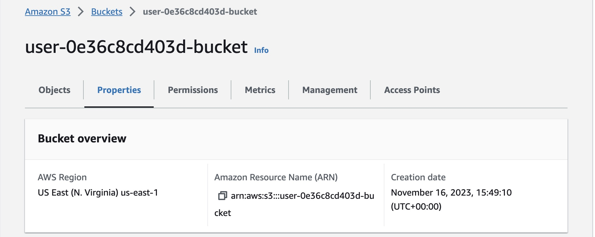
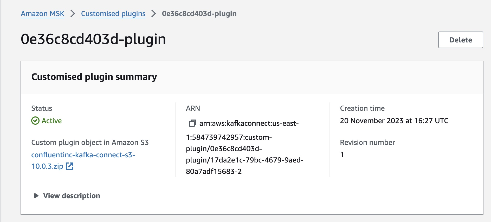
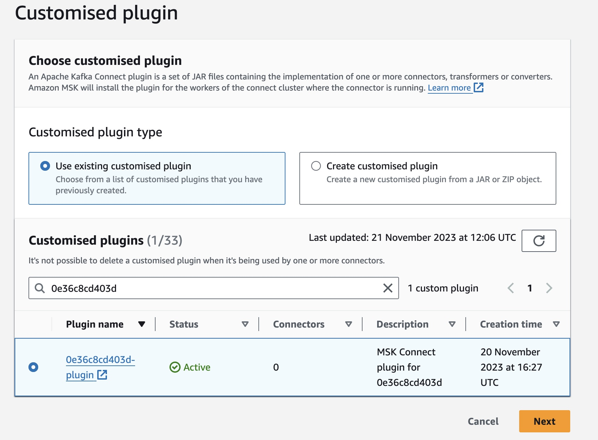
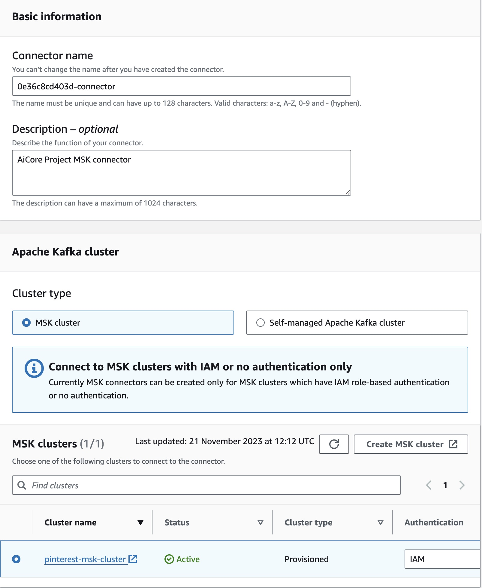
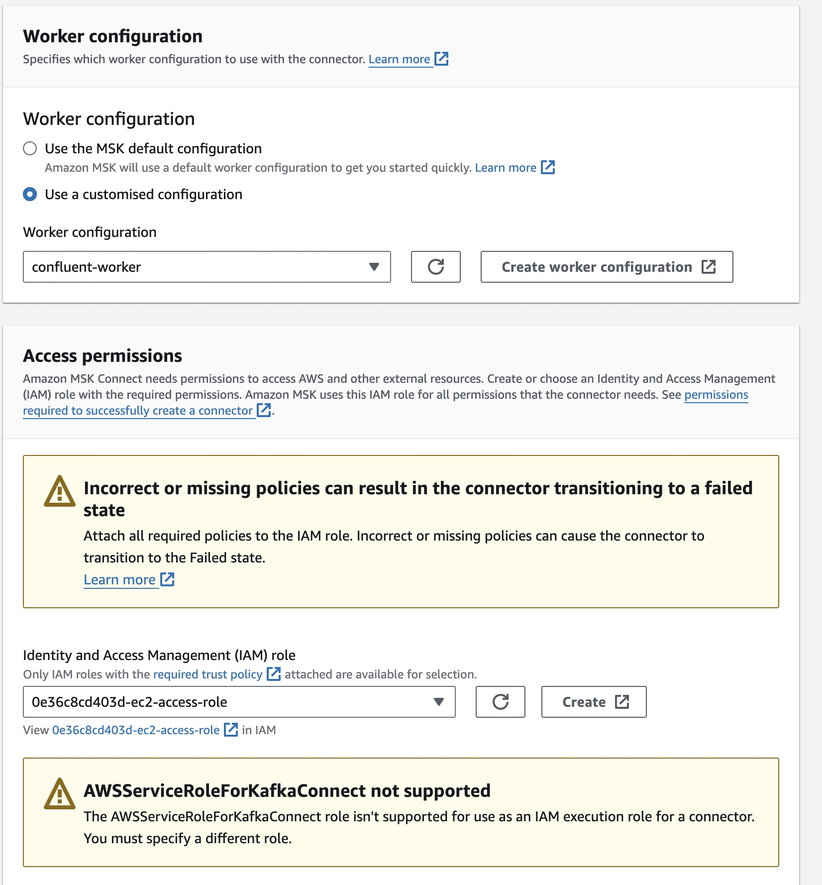

### Task 1: Create a custom plugin with MSK Connect
**Note S3 bucket name (AWS GUI)**

https://s3.console.aws.amazon.com/s3/buckets/user-0e36c8cd403d-bucket?region=us-east-1&tab=objects


**Download Confluent.io Amazon S3 Connector and copy it to s3 bucket (AWS GUI)**
```commandline
- sudo -u ec2-user -i
- mkdir kafka-connect-s3 && cd kafka-connect-s3
- wget https://d1i4a15mxbxib1.cloudfront.net/api/plugins/confluentinc/kafka-connect-s3/versions/10.0.3/confluentinc-kafka-connect-s3-10.0.3.zip
- aws s3 cp ./confluentinc-kafka-connect-s3-10.0.3.zip s3://user-0e36c8cd403d-bucket/kafka-connect-s3/
```

**Create custom plugin in the MSK Connect console (AWS GUI)**

https://us-east-1.console.aws.amazon.com/msk/home?region=us-east-1#/customPlugin/create

The plugin should reference Confluent.io Amazon S3 Connector.zip copied to the S3 bucket


### Task 2: Create a connector with MSK Connect

https://us-east-1.console.aws.amazon.com/msk/home?region=us-east-1#/connector/create


Configuration Settings
```
connector.class=io.confluent.connect.s3.S3SinkConnector
# same region as our bucket and cluster
s3.region=us-east-1
flush.size=1
schema.compatibility=NONE
tasks.max=3
# include nomeclature of topic name, given here as an example will read all data from topic names starting with msk.topic....
topics.regex=0e36c8cd403d.*
format.class=io.confluent.connect.s3.format.json.JsonFormat
partitioner.class=io.confluent.connect.storage.partitioner.DefaultPartitioner
value.converter.schemas.enable=false
value.converter=org.apache.kafka.connect.json.JsonConverter
storage.class=io.confluent.connect.s3.storage.S3Storage
key.converter=org.apache.kafka.connect.storage.StringConverter
s3.bucket.name=user-0e36c8cd403d-bucket
```
