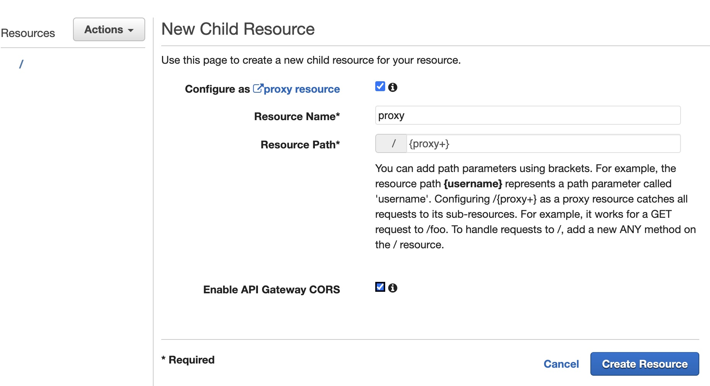
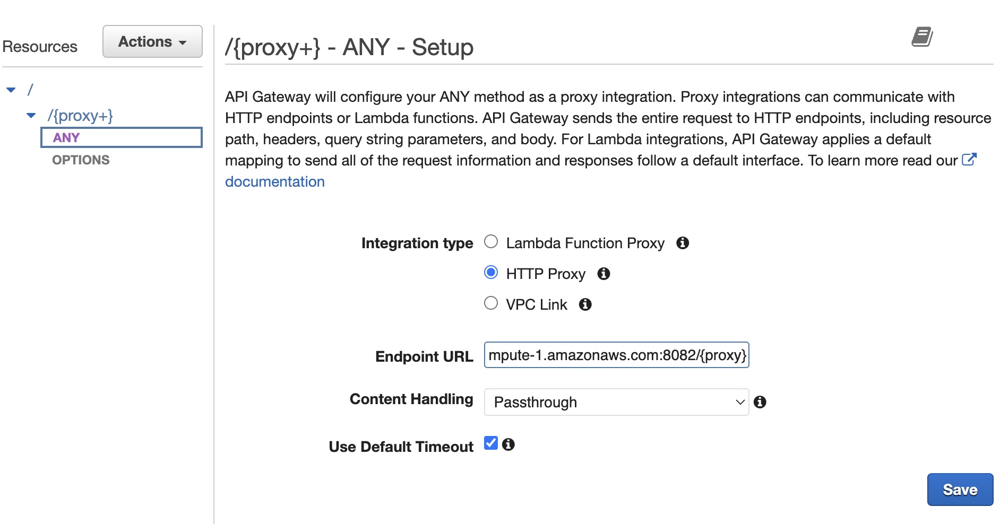
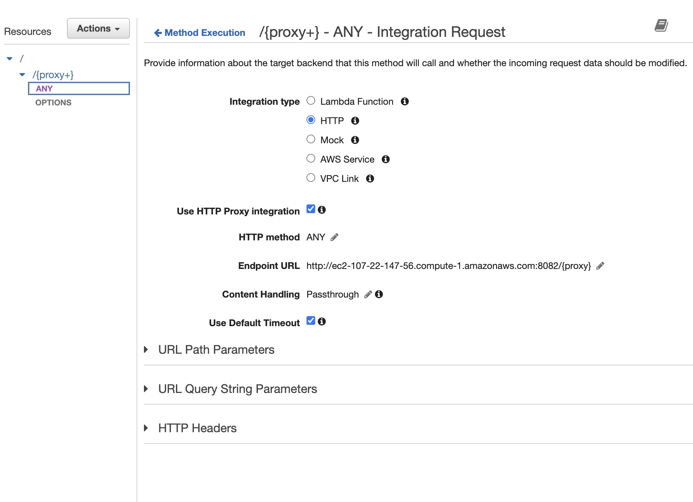
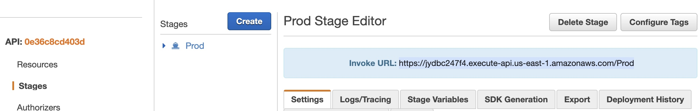
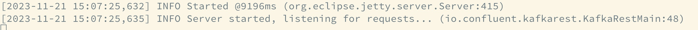
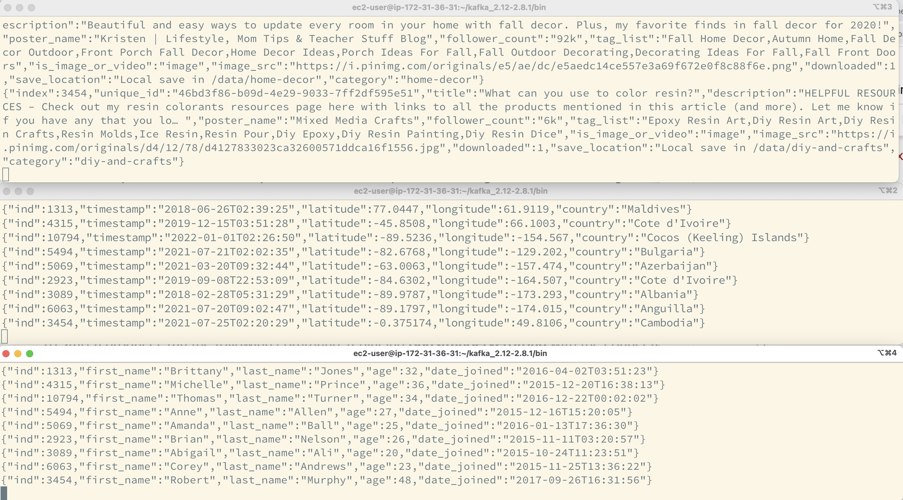
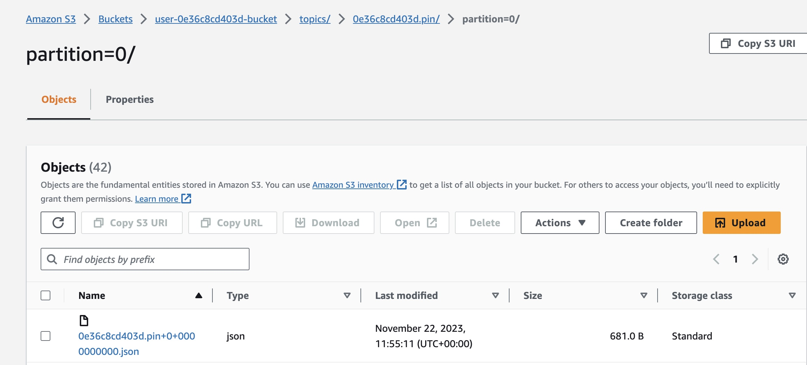

### Task 1: Build a Kafka REST proxy integration method for the API
API REST Gateway with no resources is provided

**Create a resource that allows you to build a PROXY integration for the API (AWS GUI)**

https://us-east-1.console.aws.amazon.com/apigateway/main/apis/jydbc247f4/resources/nsim9hq3uj/create-resource?api=jydbc247f4&region=us-east-1


Create an HTTP ANY method



Deploy the API



### Task 2: Set up the Kafka REST proxy on the EC2 client
**Install the confluent package for Kafka REST proxy on EC2 client (AWS console)**
```commandline
cd /home/ec2-user/
sudo wget https://packages.confluent.io/archive/7.2/confluent-7.2.0.tar.gz
tar -xvzf confluent-7.2.0.tar.gz 
```

**Allow the REST proxy to perform IAM authentication to the MSK cluster by modifying the kafka-rest.properties file.  (AWS console)**
```commandline
vi confluent-7.2.0/etc/kafka-rest/kafka-rest.properties
```
Amend the below properties
```
zookeeper.connect=z-2.pinterestmskcluster.w8g8jt.c12.kafka.us-east-1.amazonaws.com:2181,z-1.pinterestmskcluster.w8g8jt.c12.kafka.us-east-1.amazonaws.com:2181,z-3.pinterestmskcluster.w8g8jt.c12.kafka.us-east-1.amazonaws.com:2181
bootstrap.servers=PLAINTEXT://b-1.pinterestmskcluster.w8g8jt.c12.kafka.us-east-1.amazonaws.com:9098,b-3.pinterestmskcluster.w8g8jt.c12.kafka.us-east-1.amazonaws.com:9098,b-2.pinterestmskcluster.w8g8jt.c12.kafka.us-east-1.amazonaws.com:9098
```
Add the below properties
```
# Sets up TLS for encryption and SASL for authN.
client.security.protocol = SASL_SSL

# Identifies the SASL mechanism to use.
client.sasl.mechanism = AWS_MSK_IAM

# Binds SASL client implementation.
client.sasl.jaas.config = software.amazon.msk.auth.iam.IAMLoginModule required awsRoleArn="arn:aws:iam::584739742957:role/0e36c8cd403d-ec2-access-role";

# Encapsulates constructing a SigV4 signature based on extracted credentials.
# The SASL client bound by "sasl.jaas.config" invokes this class.
client.sasl.client.callback.handler.class = software.amazon.msk.auth.iam.IAMClientCallbackHandler
```

**Start the REST proxy on the EC2 client machine. (AWS console)**
```
./confluent-7.2.0/bin/kafka-rest-start /home/ec2-user/confluent-7.2.0/etc/kafka-rest/kafka-rest.properties
```


### Task 3: Send data to the API
**Modify user_posting_emulation.py to send data to Kafka topics**
[5_batch_user_posting_emulation.py](..%2F..%2F5_batch_user_posting_emulation.py)

**Check data is sent to Kafka topics with the consumer (AWS console)**

Terminal 1
```
cd kafka_2.12-2.8.1/bin
./kafka-console-consumer.sh --topic 0e36c8cd403d.pin --from-beginning --consumer.config client.properties --group students --bootstrap-server b-1.pinterestmskcluster.w8g8jt.c12.kafka.us-east-1.amazonaws.com:9098,b-3.pinterestmskcluster.w8g8jt.c12.kafka.us-east-1.amazonaws.com:9098,b-2.pinterestmskcluster.w8g8jt.c12.kafka.us-east-1.amazonaws.com:9098
```
Terminal 2
```
cd kafka_2.12-2.8.1/bin
./kafka-console-consumer.sh --topic 0e36c8cd403d.geo --from-beginning --consumer.config client.properties --group students --bootstrap-server b-1.pinterestmskcluster.w8g8jt.c12.kafka.us-east-1.amazonaws.com:9098,b-3.pinterestmskcluster.w8g8jt.c12.kafka.us-east-1.amazonaws.com:9098,b-2.pinterestmskcluster.w8g8jt.c12.kafka.us-east-1.amazonaws.com:9098
```
Terminal 3
```
cd kafka_2.12-2.8.1/bin
./kafka-console-consumer.sh --topic 0e36c8cd403d.user --from-beginning --consumer.config client.properties --group students --bootstrap-server b-1.pinterestmskcluster.w8g8jt.c12.kafka.us-east-1.amazonaws.com:9098,b-3.pinterestmskcluster.w8g8jt.c12.kafka.us-east-1.amazonaws.com:9098,b-2.pinterestmskcluster.w8g8jt.c12.kafka.us-east-1.amazonaws.com:9098
```


**Check data is getting stored in the S3 Bucket**
