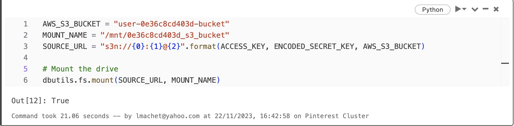
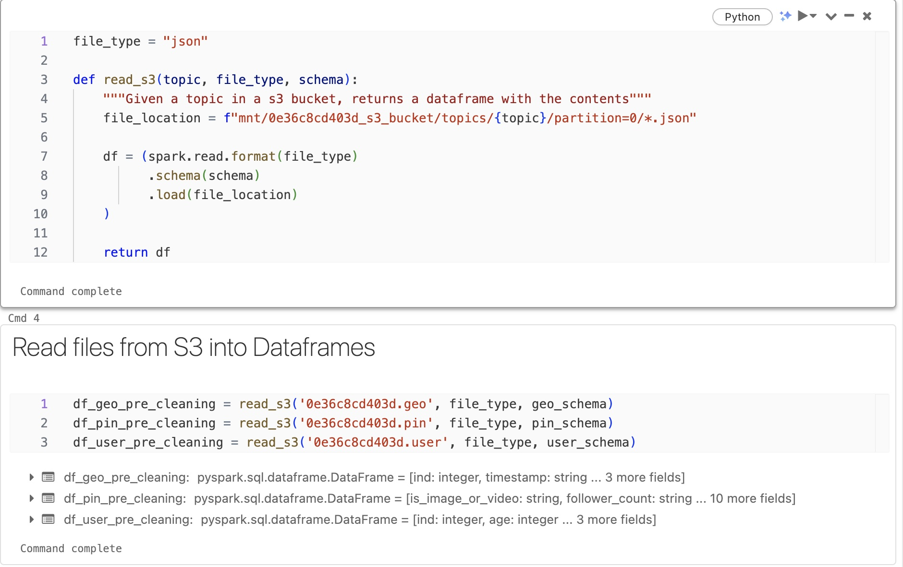

### Task 2: Mount a S3 bucket to Databricks
Pre-requisite: Databricks account has full access to S3 bucket with Access Key & Secret Access Key in authentication_credentials.csv
All steps performed in Databricks

[authenticate](..%2F..%2Futils%2Fauthenticate.ipynb)

**Mount the S3 bucket**

[Create the Schema](..%2F..%2Futils%2Fcreate_schemas.ipynb)

**Create the 3 dataframes**
