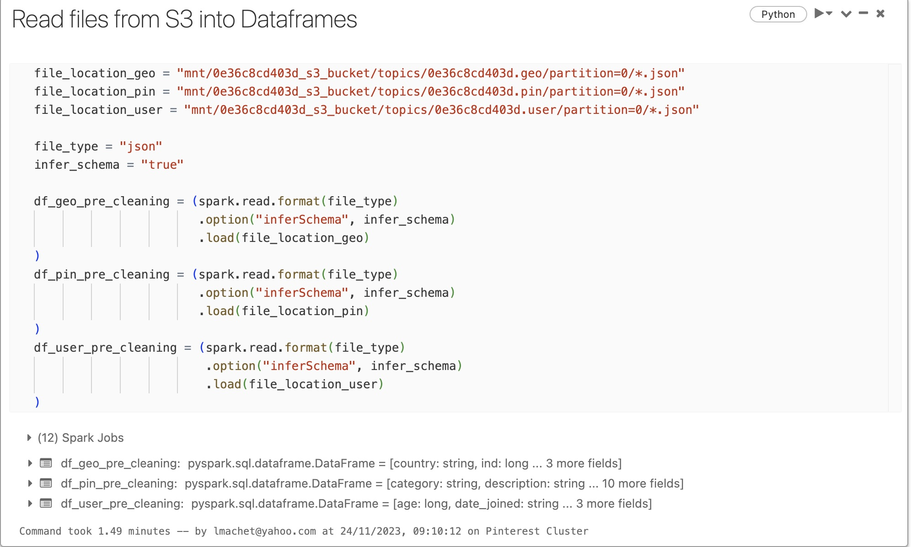

### Mount a S3 bucket to Databricks
Pre-requisite: Databricks account has full access to S3 bucket with Access Key & Secret Access Key in authentication_credentials.csv
All steps performed in Databricks

**Check for authentication_credentials.csv**
```
dbutils.fs.ls("/FileStore/tables")
```


**Read the csv with AWS keys into a spark dataframe**


**Extract AWS access key and secret key from spark dataframe**


**Mount the S3 bucket**


**Create the 3 dataframes**

