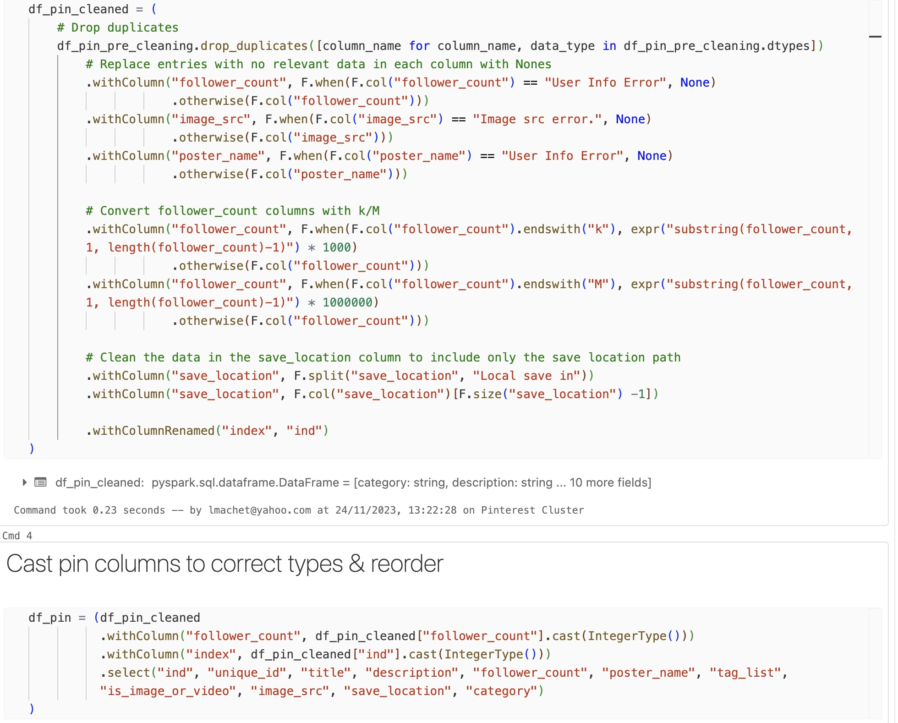
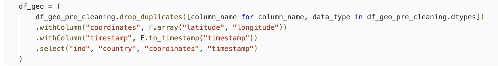
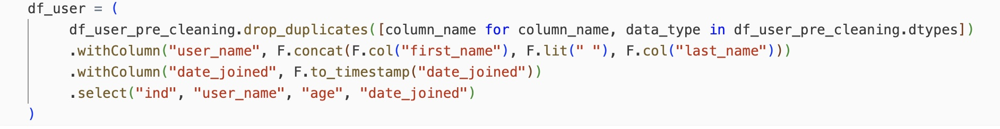
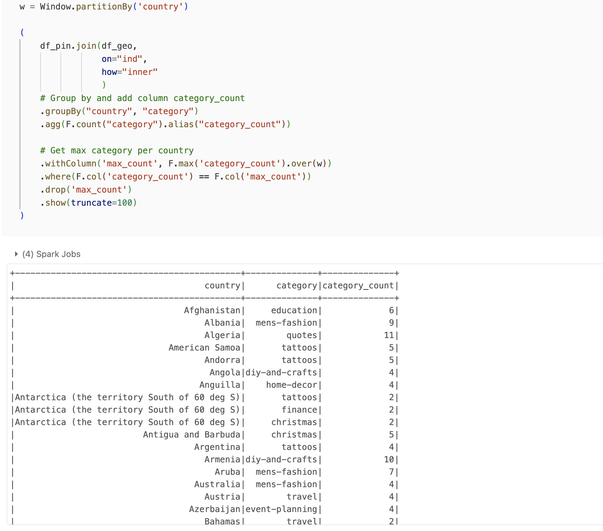

### Learn how to perform data cleaning and computations using Spark on Databricks
All steps performed in Databricks

**Clean pin data**

**Clean geolocation data**

**Clean user data**

**Find the most popular category in each country**

