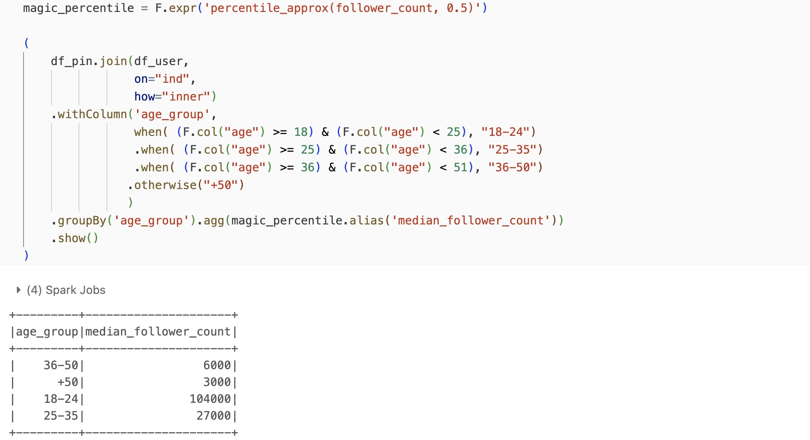

All steps performed in Databricks

### Task 1: Clean the DataFrame that contains information about Pinterest posts

### Task 2: Clean the DataFrame that contains information about geolocation

### Task 3: Clean the DataFrame that contains information about users

### Task 4: Find the most popular category in each country

### Task 5: Find which was the most popular category each year 

### Task 6: Find the user with the most followers in each country 

### Task 7: Find the country with the user with most followers

### Task 8: Find the median follower count for different age groups

### Task 9: Find how many users have joined each year
W.I.P.

### Task 10: Find the median follower count of users based on their joining year
W.I.P.

### Task 11: Find the median follower count of users based on their joining year and age group
W.I.P.