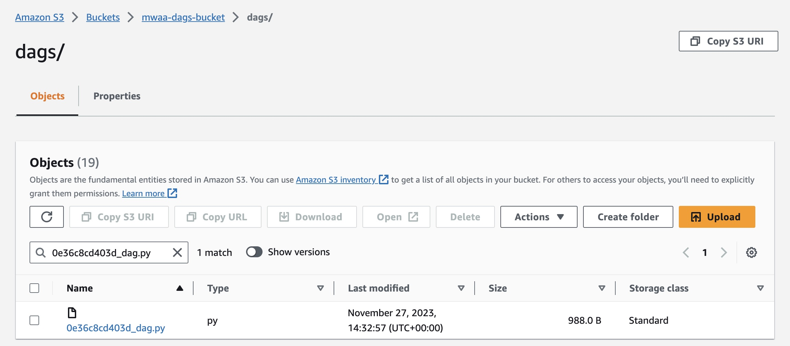
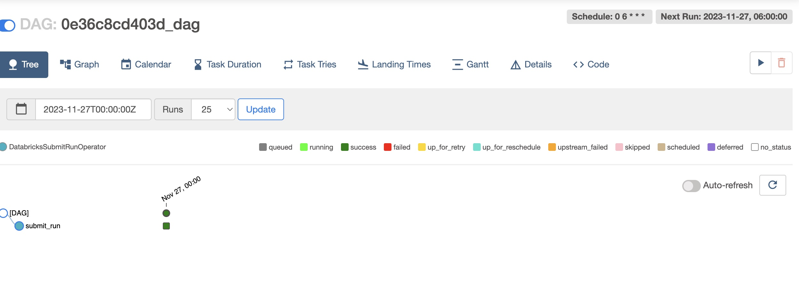

### Orchestrate Databricks Workloads on AWS MWAA

**Get Databricks Notebook path (Databricks)**
```
dbutils.notebook.entry_point.getDbutils().notebook().getContext().notebookPath().get()
```

**Get Databricks cluster-id (Databricks)**
```
spark.conf.get("spark.databricks.clusterUsageTags.clusterId")
```

**Create and upload a DAG to a MWAA environment (AWS GUI)**

Pre-Requisite: AWS account has access to MWAA environment Databricks-Airflow-env and to its S3 bucket mwaa-dags-bucket.
S3 bucket mwaa-dags-bucket contains a requirements.txt 

DAG created: [0e36c8cd403d_dag.py](..%2F..%2F0e36c8cd403d_dag.py)

DAG uploaded to mwaa-dags-bucket



**Trigger a DAG that runs a Databricks Notebook**

