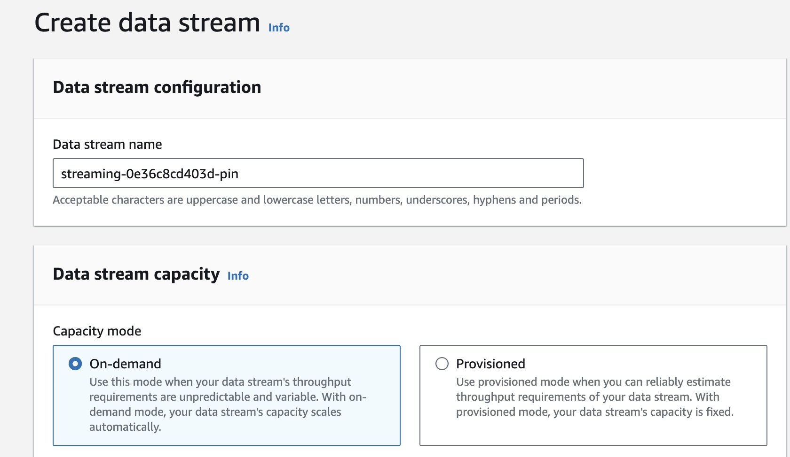
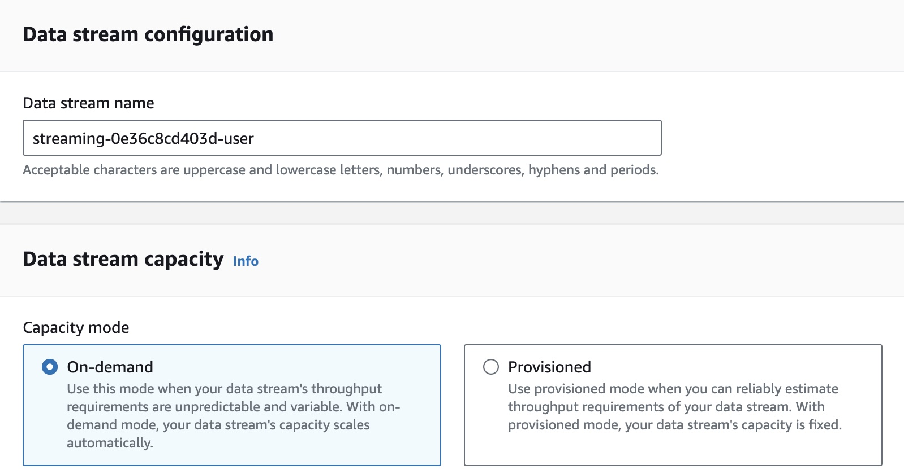
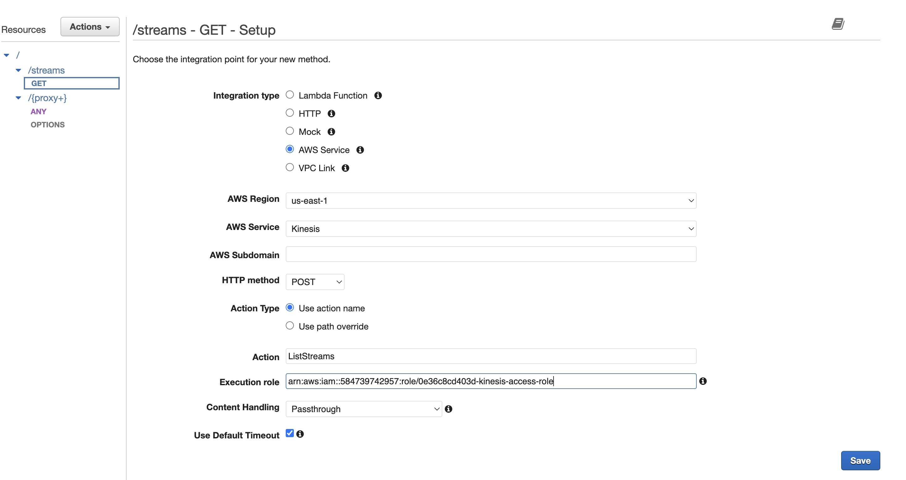
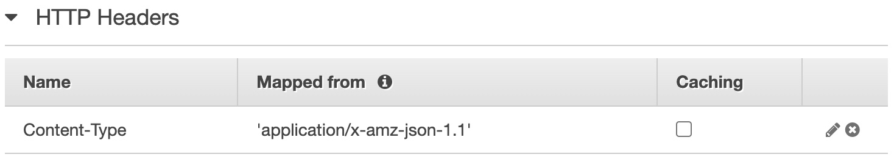
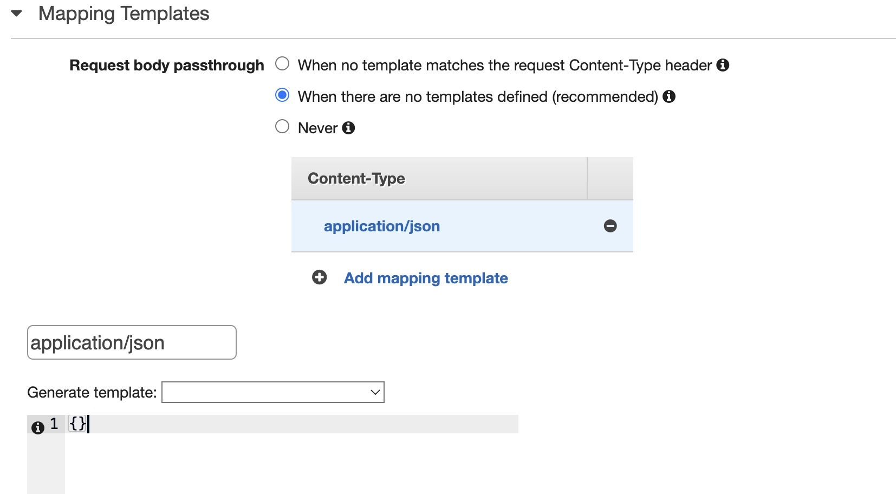
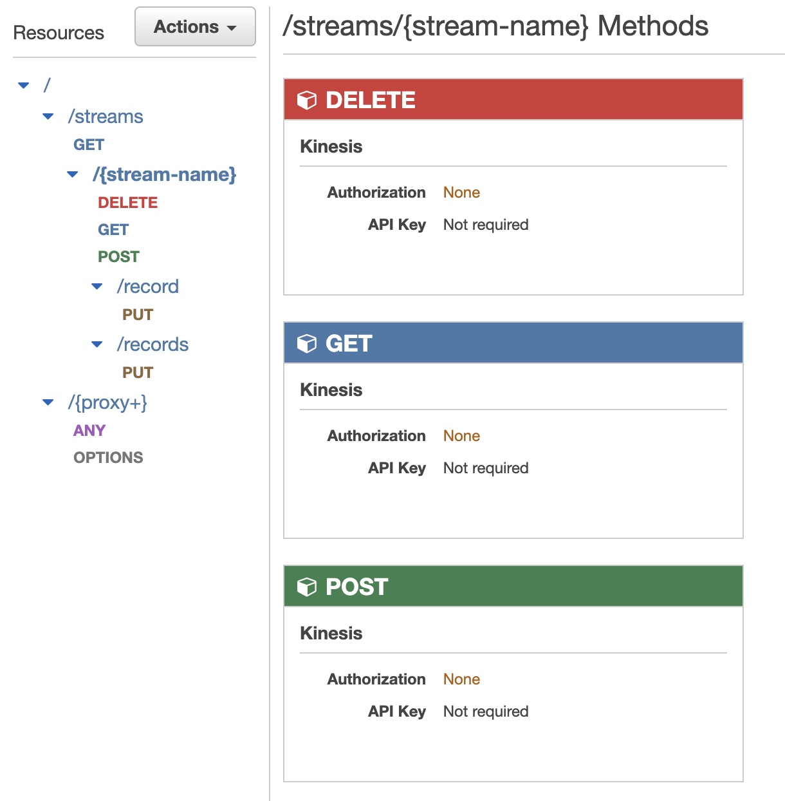
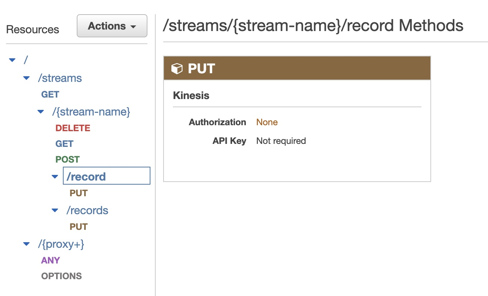
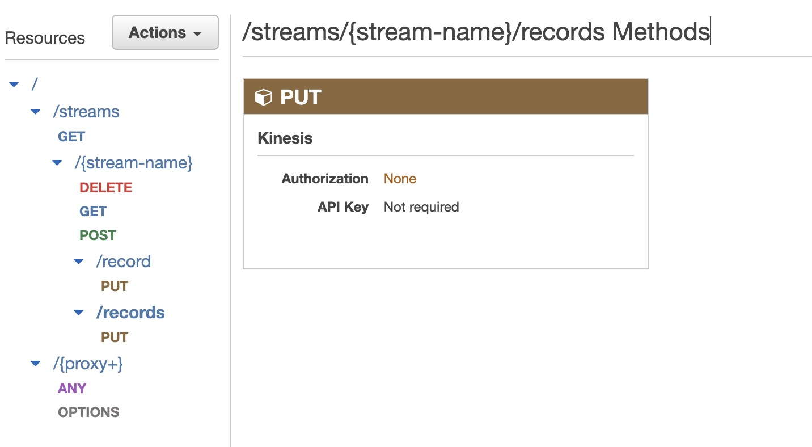

### Task 1: Create data streams using Kinesis Data Streams (AWS GUI)





### Task 2: Configure an API with Kinesis proxy integration (AWS GUI)
#### Create Resource to List Streams in Kinesis
**Create resource with GET method**


**Edit integration request add HTTP header**


**Add Mapping Template**


#### Create new child resource with methods to Create, Describe and Delete a Stream in Kinesis
**New child resource under streams with the Resource Path {stream-name}**


Create methods for each of the below using the same steps as the above with the following variations

| Method | Action         | 
|--------|----------------|
| GET    | DescribeStream |
| POST   | CreateStream   |
| DELETE | DeleteStream   |


**GET method Template contents**
```
{
    "StreamName": "$input.params('stream-name')"
}
```
**POST method Template contents**
```
{
    "ShardCount": #if($input.path('$.ShardCount') == '') 5 #else $input.path('$.ShardCount') #end,
    "StreamName": "$input.params('stream-name')"
}
```
**DELETE method Template contents**
```
{
    "StreamName": "$input.params('stream-name')"
}
```

#### Create new child resources for record and records



Create methods for each of the below using the same steps as the above with the following variations

| Resource | Method | Action      | 
|----------|--------|-------------|
| record   | PUT    | PutRecord   |
| records  | PUT    | PutRecords  |

**Resource record PUT method Template contents**
```
{
    "StreamName": "$input.params('stream-name')",
    "Data": "$util.base64Encode($input.json('$.Data'))",
    "PartitionKey": "$input.path('$.PartitionKey')"
}
```

**Resource records PUT method Template contents**
```
{
    "StreamName": "$input.params('stream-name')",
    "Records": [
       #foreach($elem in $input.path('$.records'))
          {
            "Data": "$util.base64Encode($elem.data)",
            "PartitionKey": "$elem.partition-key"
          }#if($foreach.hasNext),#end
        #end
    ]
}
```
### Task 3: Send data to the Kinesis streams


### Task 4: Read data from Kinesis streams in databricks


### Task 5: Transform Kinesis streams in databricks


### Task 6: Write the streaming data to Delta Tables
